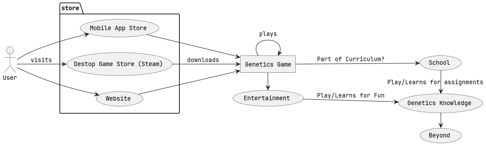

# Design Objective

The objective of this project is to create a game that enables people of diverse backgrounds
and skills learn genetics concepts, particularly highschool level genetics.

# Design Level 1

This is the simplest level of design.
Here we see that the user plays the game to learn genetics. This diagram shows the barest essence
of our objective, which is to teach people genetics concepts in a fun way through a game.

# Design Level 2

This diagram shows how the game will be distributed and incorporated within different markets.
For example, this game could be incorporated into highschool curriculums or played for
entertainment purposes. Distributing through different platforms increases accessibility. A
highschool might use the web version, to avoid the headache of installation, while a hobbyist may
desire to play the game off-line.

# Design Level 3

This diagram shows a little of the game's structure. Sequential levels allow for iterative
learning, helpful for a classroom environment, as well as an endless mode that facilitates practice.
Each level can teach a new standalone concept, while the endless mode can reinforce those concepts.
